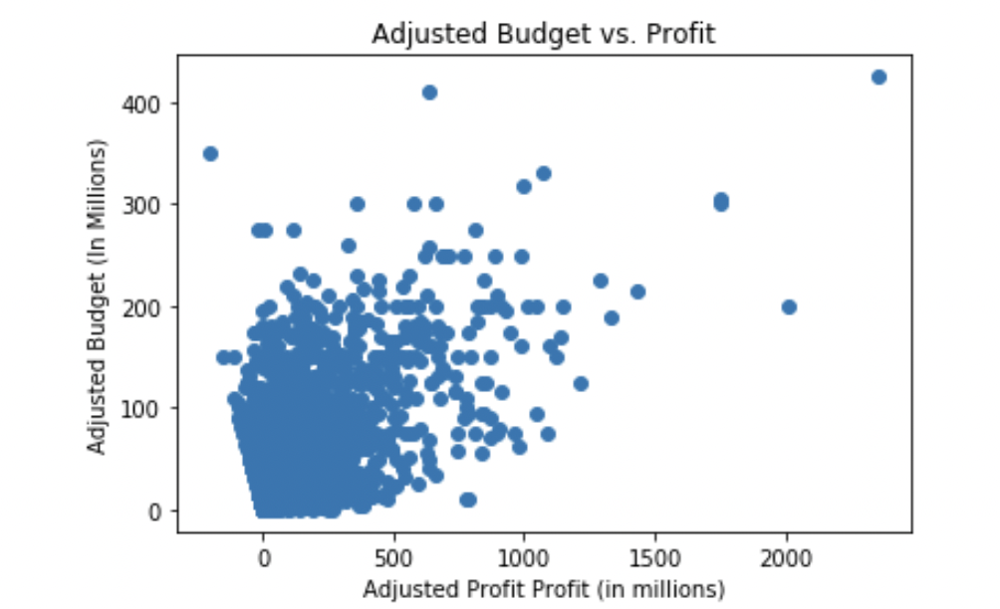
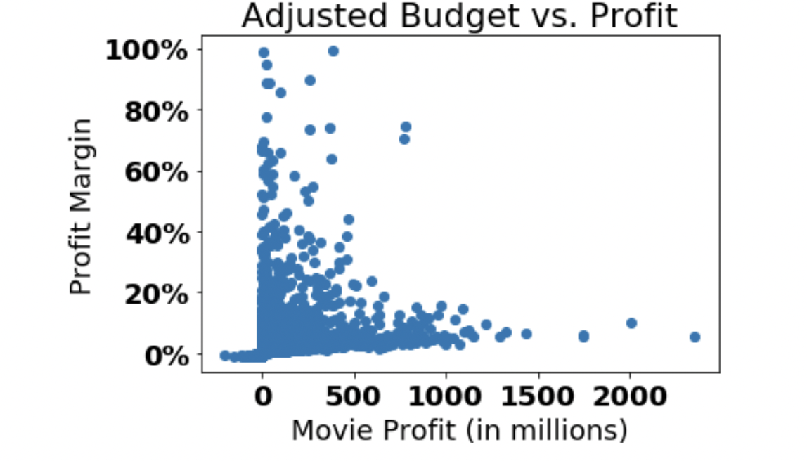

# Movies at Microsoft

# Overview

## Microsoft has decided to create their own movie studio. However, they have no working knowledge of the movie industry and need guidance to create profitable content.
## In this presentation, I will analyze past movie data to help Microsoft meet this goal.

### The following questions will be addressed:
1.) What are the production budgets and release dates of the top 10 most profitable movies?

2.) When is the best time of year to release a movie?

3.) Which movie budgets yield the highest profits?

### Data:
The data file 'tn.movie_budgets.csv.gz' provides information about the finanaces of more than 5,000 films, including production budgets and worldwide and domestic profits. It also includes general information about each movie-such as its name and release date.

### Methods:
The following Python libraries are used to analyze and display data: Pandas, Matplotlib and Numpy.

## Investigation 1: Which movie budgets yield the highest profits?
1. There is a strong, positive relationship between a movie’s production budget and its resulting profit (as a movie’s production budget increases, so does it’s profit)

2. The average production budget of all profitable movies is 38,000,000, which correlates with an average profit of 100,000,000

## Investigation 2: When is the most profitable time of year to release a film?
1. The holiday season is a profitable time of year to release a movie-particularly December. 

2. Late spring and early summer are also profitable seasons for movie releases.

## Investigation 3: What are the production budgets and release dates of the top 10 most profitable movies?
Three bar graphs are shown below.
### What are the top 10 most profitable movies?
1. Gross revenue is broken into worldwide and domestic categories.
2. Avatar takes the top spot with an overall profit of 3.5  billion dollars.
3. The average gross profit for these films is 1.7 billion dollars

### What are the production budgets of the top 10 most profitable movies?
1. Avatar-our highest grossing movie-also had the highest production budget of $425,000,000

### What are the release dates of the top 10 most profitable movies?
1. Our top three highest grossing films-Avatar, Titanic, and Star Wars Episode VII-were released in December.

2. All other films in the “Top 10” were released in Spring or early Summer-the exception being Black Panther, which was released in February.

2. The average production budget for the top 10 movies is $242,600,000

## Conclusion
1. Microsoft should release the bulk of their movies during the early summer and late fall months-ideally close to the holidays.

2. A minimum production budget of 50,000,000 is recommended for all movies. This amount correlates with an overall gross profit of 113,000,000 (44% margin)

3. If Microsoft wishes to compete with the Top 10, an average budget of $296,000,000 is recommended

## Follow-Up
For further analysis, Microsoft should research-in greater detail-the development behind the top ten most profitable movies, including budget breakdown, director selection, release date strategy, etc.

